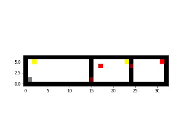

# Keys and Doors

This package provides a simple RL gridworld environment in which navigating the maps requires the agent to pickup keys in order to open doors separating each room. 
Reward locations, door locations, key locations as well as the overall structure of the map can be fully customised. 
The environment is aimed specifically at continual learning research; this is achieved primarily via a _curriculum_ interface that 
allows for modification of the environment at certain timepoints during training. Modifications include the positions of the keys and rewards, as well as the reward statistics. 

## Getting Started

There are minimal requirements for basic use of this package. The python requirements are listed in ```requirements.txt``` and can be installed via ```pip install -r requirements.txt```. The package itself can then be installed using ```pip install -e .```.
To ensure correct installation, you can run tests via ```python tests/test_integration.py```. 

For more extensive features, including visualisations you can also install additional requirements via ```pip install -r supplementary_requirements.txt``` (before installing the package). These can be tested via ```python tests/test_integration.py --full```.
A further flag ```--save``` can be used with the visualisation testing to save the output files to a sub-folder in tests.

## Example Usage

Maps are specified by a combination of an ASCII text file (with the map layout) and YAML configuration file (with key, door, reward specifications).

For instance, the ASCII and YAML snippets below (A, B) produce the map shown below (C). These example files can also be found under the ```tests/test_map_files```.

#### A. ASCII .txt file
```
#################################	#################################
# K            #       K#      R#	#              #        #       #
#              # R      D       #	#              #                #
#              #        #       #	#              #        #       #
#              #        #       #	#              #        #       #
#S             D        #       #	#                       #       #
################################# 	#################################
```

All _wall_ elements must be signified by a _#_ character, all reachable positions for the agent must be signified by an empty space, 
or by a character representing the start position (_S_), key position (_K_), door position (_D_), or reward position (_R_). 
Note: these special characters have no function but to help visualise the map when designing. This is represented by the identical 
copy to the right without the special characters: these two ascii codes will behave identically. All position specifications must be 
made in the YAML file. 

#### B. YAML File
```
start_position: [1, 1]

key_positions:
    - [23, 5] # key for door 1
    - [2, 5] # key for door 2

door_positions:
    - [15, 1] # door 1 
    - [24, 4] # door 2 

reward_positions:
    - [17, 4]
    - [31, 5]

# provide either one set of statistics (used for all rewards)
# or one set of statistics for each reward
reward_statistics:
    gaussian:
        mean: 1
        std: 0
```
#### C. Example Map


Here the agent is shown in its starting position in grey, the keys are shown in yellow, the 
doors are shown in maroon, and the rewards are shown in red.

#### D. Python API

Initialising a map in python is very simple. 

```
from key_door import key_door_env

env = key_door_env.KeyDoorGridworld(
    map_ascii_path=PATH_TO_MAP_FILE,
    map_yaml_path=PATH_TO_MAP_YAML,
    representation="agent_position",
    episode_timeout=1000
)
```

There principle method is the _step_ method, which takes an action index and returns the next state. 
The available actions are up, down, left and right. The constructor to the environment class takes three arguments: 
the path to the .txt file, the path to the .yaml file, and a field called "representation". This final argument can
either be given as _agent_position_, or _pixel_. The former dictates that the output of the _step_ method is the state represented by an x, y 
tuple of the agent position (for use with tabular RL in mind). 
The latter dictates that the output is a pixel representation of the map in the form of a numpy array (for use with function approximation in mind).

## Visualisation

By installing an additional set of requirements, it is also possible to make use of a set of visualisation methods on the environment. These methods are implemented by a wrapper around the original environment class. Available functionality includes rendering a still image of the environment at a certain time, generating a video of an episode rollout, and visualising a heatmap over the map (e.g. for value functions or visitation counts).

```
from key_door import visualisation_env

env = visualisation_env.VisualisationEnv(env)
```

## Continual Learning and MDP Transitions

As well as the visualisation wrapper, the package also includes a curriculum wrapper that allows for specification of environment transitions. To do this you can write multiple .yaml files and feed a list of yaml file paths, as well as the original environment, to the constructor of the curriculum wrapper. Calling the __next__() method on the environment will then transition the environment to the configuration specified by next .yaml file along.

```
from key_door import curriculum_env

env = curriculum_env.CurriculumEnv(env=env, transitions=[MAP_1_YAML_PATH, MAP_2_YAML_PATH, ...])
```

## Possible Future Features

There are multiple features that would be useful additions to this package ranging from small tweaks like random start positions to more complex changes such as procedural generation.